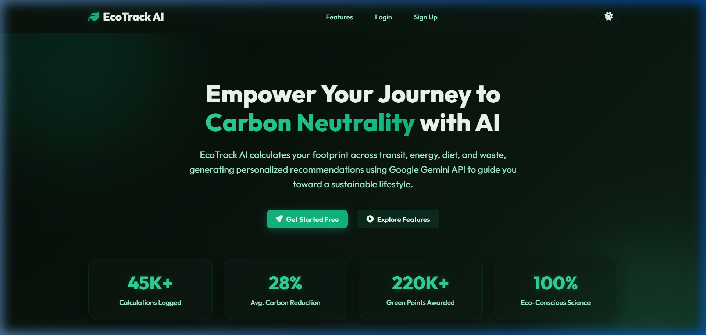
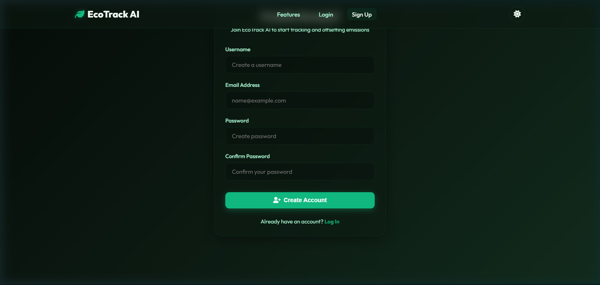
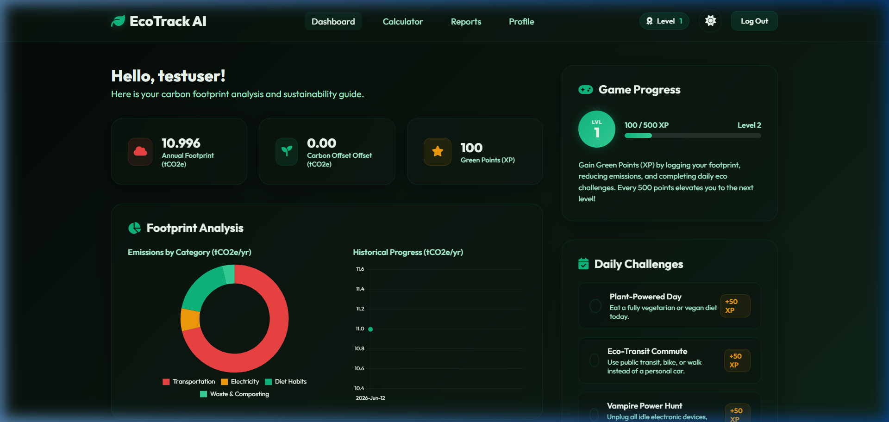
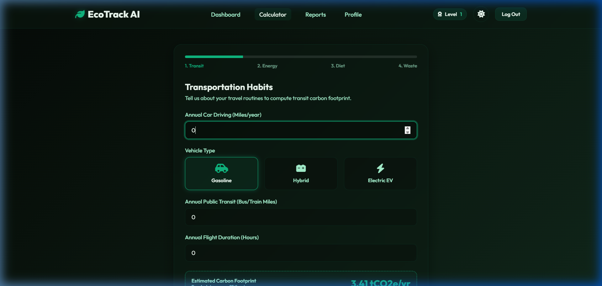
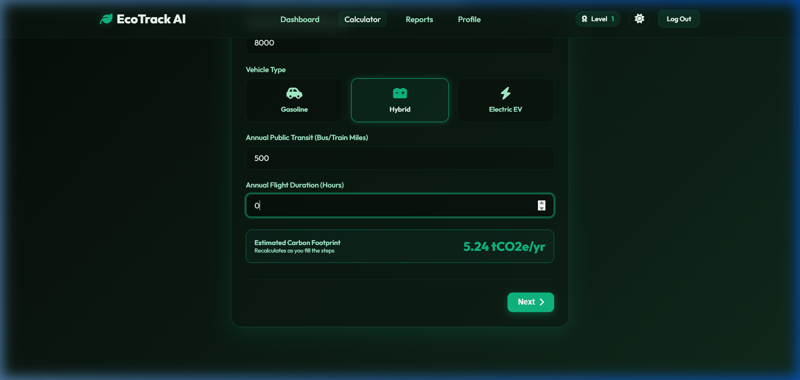

# EcoTrack AI – Carbon Footprint Awareness Platform

EcoTrack AI is a full-stack web application designed to help individuals track, analyze, and offset their carbon footprint. Utilizing modern web design, interactive charts, and Google's Gemini API, the platform provides users with personalized eco-friendly tips, weekly action plans, gamified challenges, and downloadable PDF carbon audit reports.

---

## Features

1. **User Authentication**: Secure signup and login with hashed password storage in SQLite.
2. **Interactive Footprint Wizard**: A multi-step carbon calculator covering transport, utilities, food habits, and recycling with live real-time emissions projections.
3. **Dynamic Dashboard**: Highlights totals, offsets, and category trends via Chart.js, featuring checking off daily eco challenges and tracking level progression.
4. **AI-Powered Recommendations**: Integrates Google Gemini API to analyze carbon footprints and deliver personalized impact summaries, sustainability tips, and a 7-day action roadmap. Includes a local rule-based fallback if the API is offline.
5. **Gamification & Milestones**: Earn points (XP), unlock levels, and earn badges (e.g. *Eco Novice*, *Carbon Reducer*, *Challenge Champion*).
6. **Reports & Exports**: Visual history charts with multi-category toggle filters, exporting logs as CSV, and high-fidelity client-side PDF document downloads using `html2pdf.js`.
7. **Leaderboard & Rankings**: A global leaderboard displaying ranked users based on their percentage carbon footprint reduction, incentivizing ecological action.
8. **Admin Console**: Monitored view showing platform statistics (registered users, average platform carbon score) and a user directory leaderboard.
9. **Dual Theme UI**: Sleek, glassmorphic layout supporting a *Deep Forest Dark Mode* (default) and *Fresh Mint Light Mode* with ambient gradient animations.

---

## Tech Stack

* **Frontend**: HTML5, CSS3 (Vanilla Custom Properties & Glassmorphism), JavaScript (ES6, AJAX, Chart.js, html2pdf.js)
* **Backend**: Python (Flask)
* **Database**: SQLite (SQLAlchemy ORM)
* **AI Engine**: Google Gemini API (`gemini-1.5-flash` model REST API calls)

---

## Project Structure

```
promptwar 3/
├── app.py                  # Main Flask controller & endpoint routes
├── models.py               # SQLAlchemy Database schemas & user badges logic
├── gemini_helper.py        # Gemini API client & intelligent local fallbacks
├── requirements.txt        # PIP dependencies list
├── render.yaml             # Render infrastructure blueprint
├── wsgi.py                 # production WSGI runner
├── README.md               # User guide & local installation instructions
├── static/
│   ├── css/
│   │   └── style.css       # Custom design system with light/dark variables
│   └── js/
│       ├── main.js         # AJAX requests, theme switching, UI interactions
│       └── calculator.js   # Form wizard validation & realtime score estimation
└── templates/
    ├── base.html           # Core HTML frame & navbar metrics indicators
    ├── index.html          # Startup SaaS style landing page
    ├── login.html          # Authentication entry page
    ├── signup.html         # User signup registration page
    ├── dashboard.html      # User analytics, daily challenges & AI advice tabs
    ├── calculator.html     # Multi-step wizard form & submit loader page
    ├── reports.html        # Multi-variable charts, CSV downloads & PDF generator
    ├── leaderboard.html    # Ranked carbon footprint reduction community board
    ├── profile.html        # Profile settings, SVG avatars & account data reset
    └── admin.html          # Global platform insights & stats
```

---

## Installation & Local Execution

### Prerequisites
* Python 3.8 or higher installed on your machine.
* Pip (Python Package Installer).

### 1. Configure the Codebase
Navigate into the project directory:
```bash
cd "promptwar 3"
```

### 2. Install Dependencies
Install the required packages:
```bash
pip install -r requirements.txt
```

### 3. Configure API Key
Get a free Gemini API key from [Google AI Studio](https://aistudio.google.com/). Set the key in your terminal session:

* **Windows PowerShell**:
  ```powershell
  $env:GEMINI_API_KEY="your-api-key-here"
  ```
* **macOS/Linux**:
  ```bash
  export GEMINI_API_KEY="your-api-key-here"
  ```

*Note: If the key is not set or the connection fails, EcoTrack AI automatically utilizes an intelligent, local rule-based system to formulate recommendations, ensuring no breaks in the user experience.*

### 4. Run the Dev Server
Launch the Flask development server:
```bash
python app.py
```
Open [http://127.0.0.1:5000](http://127.0.0.1:5000) in your web browser.

---

## Running the Test Suite

EcoTrack AI includes a comprehensive test suite covering models, route validations, API mock fallbacks, and gamification calculations.

### Run Automated Tests
Run the entire unittest suite locally using:
```bash
python -m unittest discover -s tests
```

For more details on automated test cases, manual testing procedures, and checklist instructions, please refer to the [TESTING.md](TESTING.md) guide.

---

## Testing Credentials

### Standard Users
1. Register a new account via the **Sign Up** page.
2. Complete your first calculation. The app will automatically guide you through.

### Admin Dashboard
To examine the Platform Admin Console:
1. Go to the **Login** page.
2. Enter the default administrator credentials:
   * **Username/Email**: `admin`
   * **Password**: `admin123`
3. A **"Admin Panel"** link will appear in gold in the navigation bar. Click it to view global analytics and the user ranking leaderboard.

*Note: Any new account registered with a username/email starting with `admin` is automatically elevated to administrator privileges.*

---

## Deployment on Render

This project includes a `render.yaml` configuration for immediate deployment on [Render](https://render.com/):
1. Push this code to your GitHub repository.
2. Link your GitHub account to Render.
3. Deploy a new service by selecting **Blueprints** and pointing to this repository.
4. Render will automatically parse the `render.yaml` file, build the environment, generate a secure `SECRET_KEY`, and deploy the web service using Gunicorn.
5. Make sure to define the `GEMINI_API_KEY` environment variable in your Render dashboard under the service's Environment settings.

---

## Screenshots

### 🌟 SaaS Landing Page


### 📋 Carbon Footprint Calculator


### 📊 Gamified Dashboard


### 💡 AI Recommendations


### 📈 Reports & Trends

